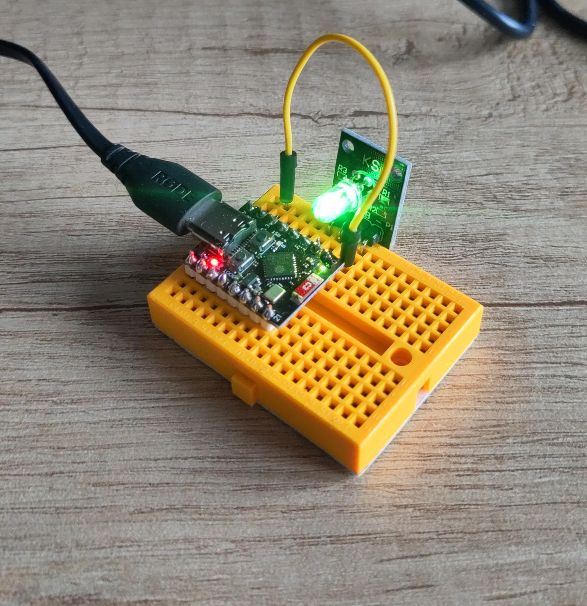

## Learning how to program `esp32c3` with Rust & IDF bindings

Using this little clone with a triple RGB LED (not the WS2812B), randomizing the colour components.

- Generated from https://github.com/esp-rs/esp-idf-template
- WiFi "library" borrowed from https://github.com/esp-rs/std-training/tree/main/common/lib/wifi

